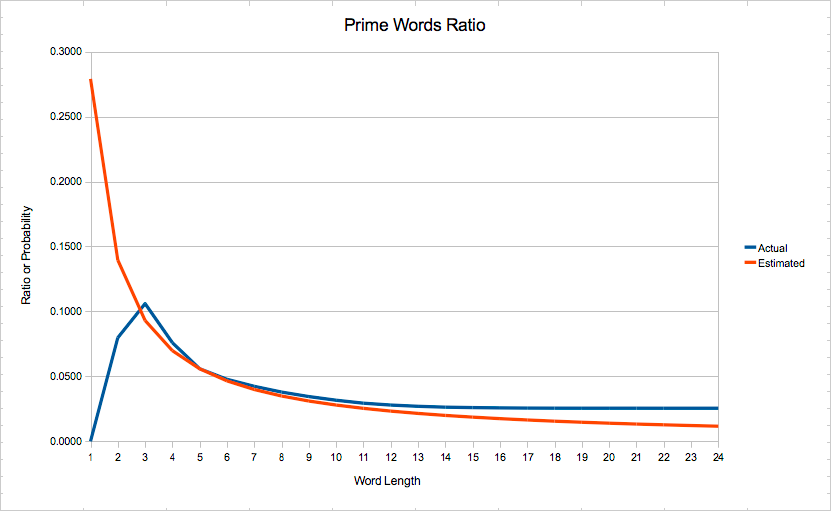

## Prime Words

Inspired by John D. Cook's [post](http://www.johndcook.com/blog/2011/04/09/words-that-are-primes-base-36/).

### Data Files

*words.txt* -- Mac dictionary file `/usr/share/dict/words` with all words in lowcase
and duplicates removed.

*words.int* -- `words.txt` with all words taken as numbers in base 36 and converted to base 10.

*words.int.prime* -- prime numbers from `words.int`.

*words.txt.prime* -- `words.int.prime` with all numbers written in base 36.

### Statistics

Longest words: formaldehydesulphoxylate, pathologicopsychological, scientificophilosophical, tetraiodophenolphthalein, thyroparathyroidectomize -- 24 characters each.

Biggest word: thyroparathyroidectomize (18397785478878442702499607332564825498).

Biggest prime: superultrafrostified (10713653314034987100763348512997).

### Ratio and Probability of Prime Words

The data for the diagram is in `primes.ods` file.

